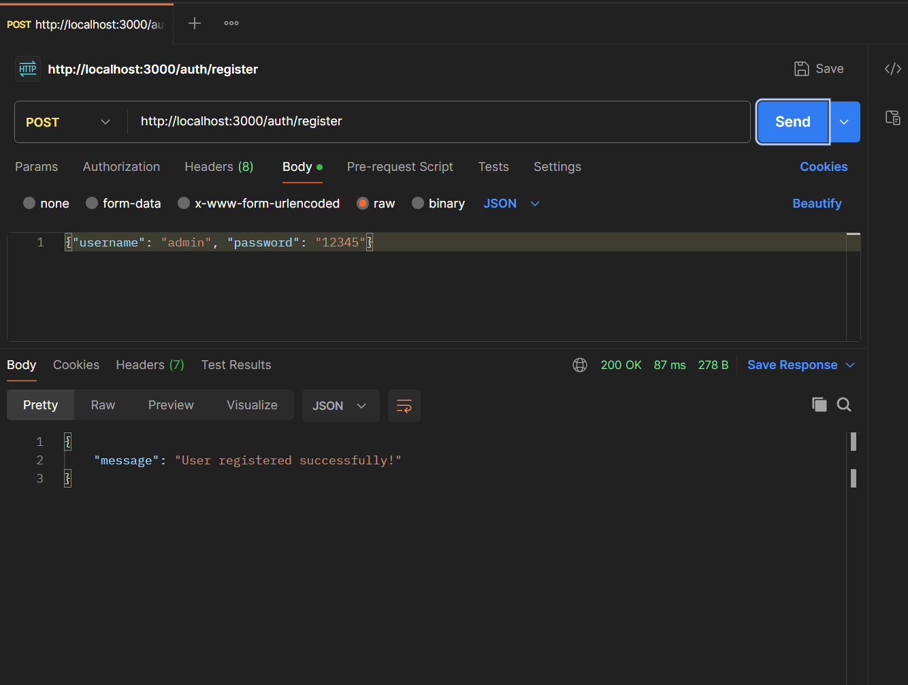
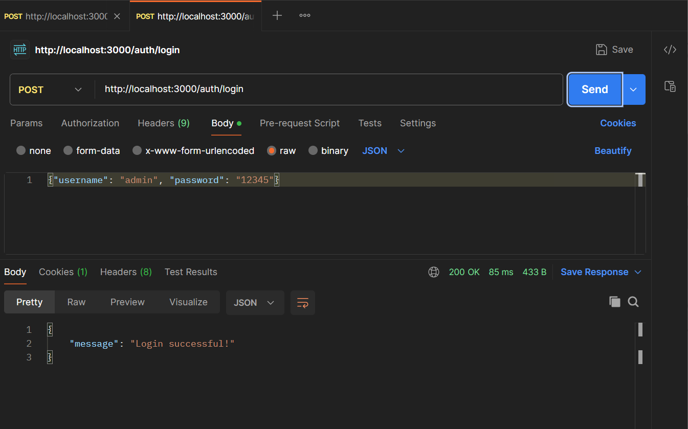
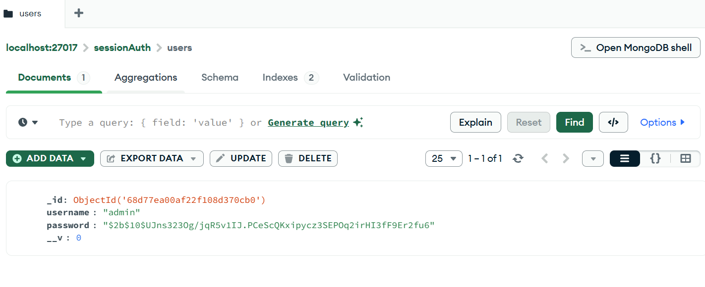
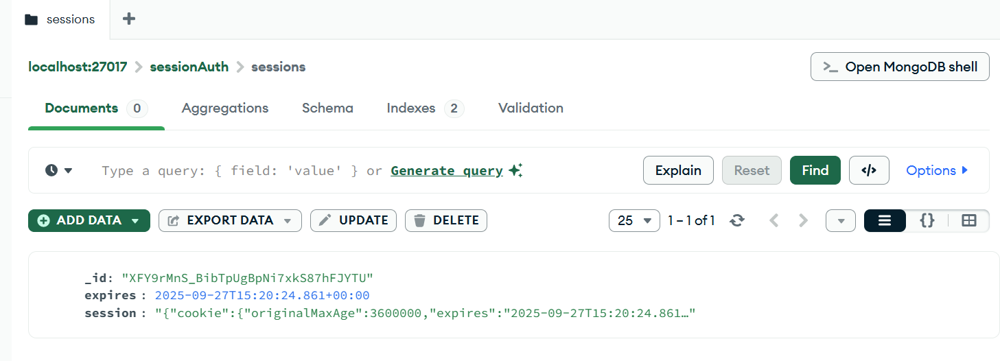
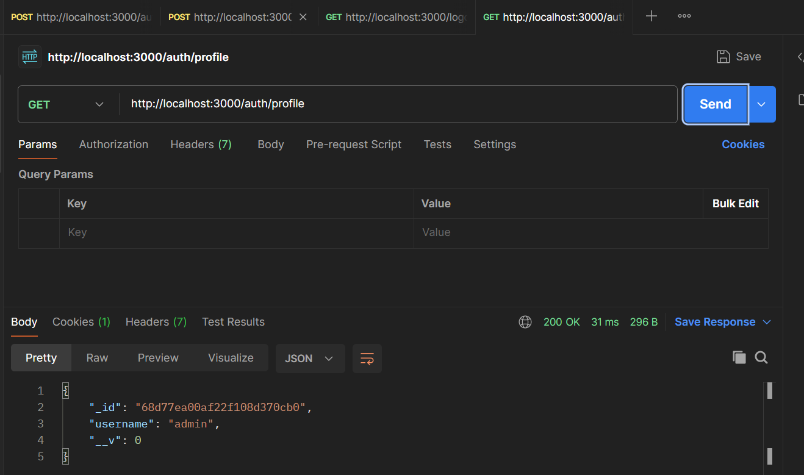
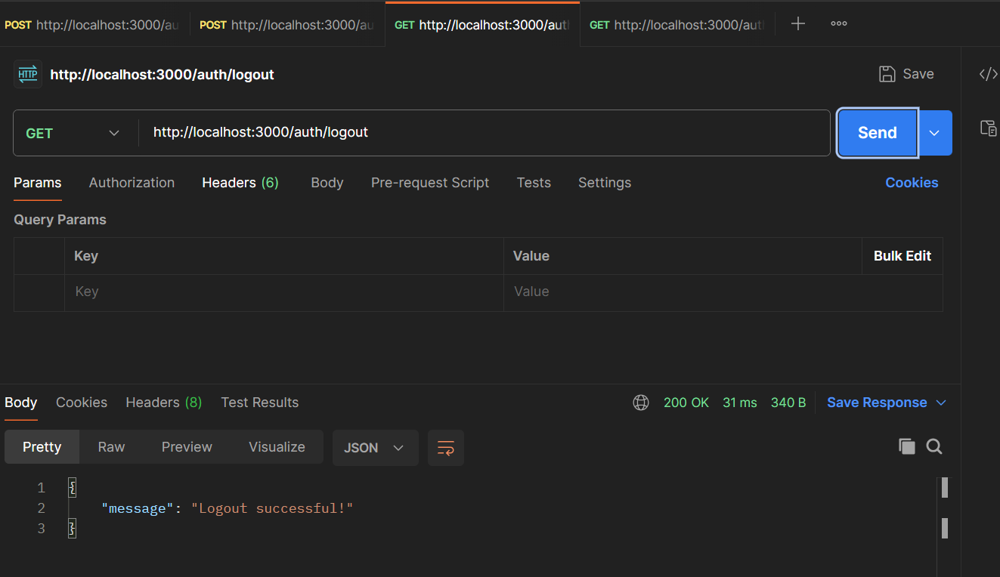

# Hướng dẫn chạy và kiểm tra các chức năng

## 1. simple_auth source code

### a. Chạy basic_auth.js

```bash
node basic_auth.js
```

**Hint:**  
Hint to add `authorization` field in request header

```
Authorization: Basic <base64(username:password)>
```

### b. Chạy cookie_auth.js

```bash
node cookie_auth.js
```

**Hint:**  
Sau khi đăng nhập thành công, cookie sẽ được hiển thị.  
Kiểm tra cookie được lưu trong MongoDB.

---

## 2. cookie_session_auth source code

### a. Chạy cookie_auth.js

```bash
node cookie_auth.js
```

### b. Đăng ký (register)

- Gửi thông tin đăng ký.
- Kiểm tra tài khoản đã được lưu trong database.



### c. Đăng nhập (login)

- Gửi thông tin đăng nhập.
- Kiểm tra xác thực trong database.



### Check in database



### d. Kiểm tra cookie trong database

- Sử dụng MongoDB Compass hoặc lệnh truy vấn MongoDB để kiểm tra cookie đã được lưu trong database.



### e. Truy cập trang profile

- Sau khi đăng nhập, truy cập trang profile để kiểm tra thông tin người dùng.



### f. Đăng xuất (logout)

- Đăng xuất khỏi hệ thống.
- Kiểm tra cookie đã bị xóa trong database.


---

**Lưu ý:**

- Đảm bảo đã cài đặt đầy đủ các package cần thiết bằng lệnh `npm install`.
- Các thao tác kiểm tra database có thể thực hiện qua MongoDB Compass hoặc lệnh truy vấn MongoDB.